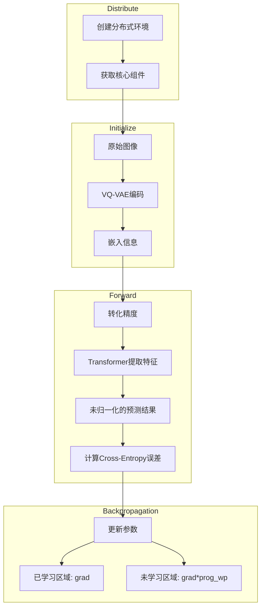

# VAR pipeline

## Training pipeline

- 优化器：带混合精度的AmpOptimizer

  ```python
  var_optim = AmpOptimizer(
      mixed_precision=args.fp16,
      optimizer=torch.optim.AdamW(params, lr=args.tlr, betas=(0.9, 0.95), 
      grad_clip=args.tclip,
      n_gradient_accumulation=args.ac
  )
  ```

- Loss Function：Cross Entropy

- epoch、batch_size自定义

- 动态调整学习率、权重衰减率

  ```python
  lr = base_lr * min(1.0, (it / warmup_it)) * 0.5*(1 + cos(π*(it - warmup_it)/(max_it - warmup_it)))
  ```

- drop_out率自定义



- Distribute：核心组件包括 `trainer` `logger` `iters_train` `start_it` `ld_train` `ld_val` 

- Initialize：

  - VQ-VAE编码中的 `Encoder` 具体架构如下：

    - 卷积：映射到基础通道数维度

    - 输入：`len(patch)` 个层级

      - 每个层级中有 `num_resnet` 个残差块【第一个残差块实现通道数倍增，后面的残差快保持通道数不变，倍增率看 `in_ch_mult` 与 `ch_mult`】，`1` 个下采样块（非最高一级）【卷积，stride=2实现分辨率减半】
      - 若是最高一级且允许注意力，则在最高一级中加入自注意力块

    - 中间处理：

      - `1` 个残差块
      - `1` 个注意力块
      - `1` 个残差快

      保持通道数不变、分辨率不变，提高特征表示能力

    - 输出

      - 组归一化
      - $SiLU$ 激活函数
      - 卷积

  - 量化过程：直通估计

- Forward中的嵌入信息包含

  - 类别嵌入：真实标签，教师强制，若是开始阶段则直接使用 *标签* 作为输入，若是后续阶段使用 *输入数据+标签* 

  - 位置编码

  - 层级标识

    ```python
    def forward(self, label_B, x_BLCv):
        # 条件嵌入（含10%的cond_drop）
        label_B = torch.where(torch.rand(B) < 0.1, self.num_classes, label_B)
        cond = self.class_emb(label_B)  # [B,D]
        
        # 三级条件融合
        x = x + cond + self.pos_1LC + self.lvl_embed(self.lvl_1L)
    ```

  - 预测结果的计算方式是用Transformer提取的特征做自适应层归一化，条件向量 `label` 会动态调整归一化参数，然后用线性投影映射到 $V \space (Vocab)$ 维上

  - 损失计算时是渐进加权

    ```python
    loss = (ce_loss * self.loss_weight[:, :current_L]).sum()  # 渐进加权
    #or
    loss = loss.mul(lw).sum(dim=-1).mean() # 渐进加权后求均值
    ```

- Backpropagation中，在更新参数时，是分区处理，对于未学习过的区域，需要乘上热身系数 $(0,1]$ ，热身系数随训练过程线性增长，刚开始小，后面随着已学习区域的扩大，热身系数也不断变大，最后就是正常更新梯度。

  实现loss的平滑过渡，防止突变，也能防止遗忘之前所学，从直观上感受，是从粗略学习到精调的过程。

  ```python
  lw = self.loss_weight[:, :ed].clone() # 记录之前参数，避免遗忘
  lw[:, bg:ed] *= min(max(prog_wp, 0), 1) # 应用热身系数实现注意力引导，关注当前分辨率特征
  ```

- 需要理清楚的思路：

  - 优化器的实现方式，独特在哪里
  - Encoder架构采用残差块+注意力块的优势，为什么要组归一化，组归一化是什么，为什么用SiLU
  - 量化的实现方式
  - 嵌入的实现方式，为什么要类别嵌入和层级标识（位置编码是因为Transformer中没有位置信息），他们又是怎么求出来的，嵌入式怎么实现嵌入的
  - 位置编码如何计算
  - 训练时到底是逐个patch操作（比如在嵌入和Transformer计算中），还是先对所有patch嵌入，再对所有patch嵌入结果进行Transformer计算，把结果输入get_logits。在源代码的哪里能找到，两方法有区别吗
  - get_logits为什么要用AdaLN，这个是什么，为什么还要结合cond_B来动态调整归一化参数