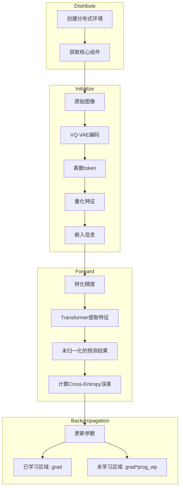
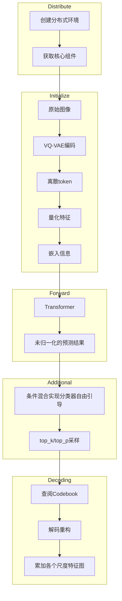

# VAR pipeline

[TOC]

## Training pipeline

- 优化器：带混合精度的AmpOptimizer

  ```python
  var_optim = AmpOptimizer(
      mixed_precision=args.fp16,
      optimizer=torch.optim.AdamW(params, lr=args.tlr, betas=(0.9, 0.95), 
      grad_clip=args.tclip,
      n_gradient_accumulation=args.ac
  )
  ```

- Loss Function：Cross Entropy

- epoch、batch_size自定义

- 动态调整学习率、权重衰减率

  ```python
  lr = base_lr * min(1.0, (it / warmup_it)) * 0.5*(1 + cos(π*(it - warmup_it)/(max_it - warmup_it)))
  ```

- drop_out率自定义



- Distribute：核心组件包括 `trainer` `logger` `iters_train` `start_it` `ld_train` `ld_val` 

- Initialize：

  - VQ-VAE编码中的 `Encoder` 具体架构如下：

    - 卷积：映射到基础通道数维度

    - 输入：`len(patch)` 个层级

      - 每个层级中有 `num_resnet` 个残差块【第一个残差块实现通道数倍增，后面的残差快保持通道数不变，倍增率看 `in_ch_mult` 与 `ch_mult`】，`1` 个下采样块（非最高一级）【卷积，stride=2实现分辨率减半】
      - 若是最高一级且允许注意力，则在最高一级中加入自注意力块

    - 中间处理：

      - `1` 个残差块
      - `1` 个注意力块
      - `1` 个残差快

      保持通道数不变、分辨率不变，提高特征表示能力

    - 输出

      - 组归一化
      - $SiLU$ 激活函数
      - 卷积

  - 量化过程：直通估计

- Forward中的嵌入信息包含

  - 类别嵌入：真实标签，教师强制，若是开始阶段则直接使用 *标签* 作为输入，若是后续阶段使用 *输入数据+标签* 

  - 位置编码

  - 层级标识

    ```python
    def forward(self, label_B, x_BLCv):
        # 条件嵌入（含10%的cond_drop）
        label_B = torch.where(torch.rand(B) < 0.1, self.num_classes, label_B)
        cond = self.class_emb(label_B)  # [B,D]
        
        # 三级条件融合
        x = x + cond + self.pos_1LC + self.lvl_embed(self.lvl_1L)
    ```

  - 预测结果的计算方式是用Transformer提取的特征做自适应层归一化，条件向量 `label` 会动态调整归一化参数，然后用线性投影映射到 $V \space (Vocab)$ 维上

  - 损失计算时是渐进加权

    ```python
    loss = (ce_loss * self.loss_weight[:, :current_L]).sum()  # 渐进加权
    #or
    loss = loss.mul(lw).sum(dim=-1).mean() # 渐进加权后求均值
    ```

- Backpropagation中，在更新参数时，是分区处理，对于未学习过的区域，需要乘上热身系数 $(0,1]$ ，热身系数随训练过程线性增长，刚开始小，后面随着已学习区域的扩大，热身系数也不断变大，最后就是正常更新梯度。

  实现loss的平滑过渡，防止突变，也能防止遗忘之前所学，从直观上感受，是从粗略学习到精调的过程。

  ```python
  lw = self.loss_weight[:, :ed].clone() # 记录之前参数，避免遗忘
  lw[:, bg:ed] *= min(max(prog_wp, 0), 1) # 应用热身系数实现注意力引导，关注当前分辨率特征
  ```

- 需要理清楚的思路：

  - 优化器的实现方式，独特在哪里

    - 优化器是用自定义的 `AmpOptimizer` ，独特之处在于使用了梯度精度裁剪，在 `FP16` 精度下计算，但保留 `FP32` 类型的数据副本

    - 输入：loss、stepping

    - 输出：元组，（梯度范数，缩放器对数尺度）

    - 关键步骤：这是混合精度计算的关键步骤，因为 `FP16` 表示范围有限，所以有些梯度值可能会发生下溢，所以先让loss乘上缩放系数，放大loss，相应地grad也会被放大，防止梯度下溢，在进行梯度更新前再让梯度除以缩放系数，恢复原样，再调用 optimizer.step使用 `FP32` 精度来更新参数，

      ```python
      self.scaler.step(self.optimizer) 
      ```

      使用缩放器进行梯度更新，首先会反向缩放梯度，也就是用当前梯度除以缩放因子，因为之前使用loss计算梯度时乘上了缩放系数，然后再调用optimizer.step更新梯度

    - 【我的理解是：之所以有缩放，是因为会有梯度更新步数累计，所以loss的缩放系数是 $1/ac$ **（错误）** ，缩放是为了防止梯度下溢，如上所述与梯度累计是两个独立的概念。梯度累计是为了解决显存不足的问题，手动将多步梯度的均值作为最终梯度。

      梯度缩放 —— 数值稳定性技术

      梯度累计 —— 显存优化技术】

  - Encoder架构采用残差块+注意力块的优势，为什么要组归一化，组归一化是什么，为什么用SiLU

    - `Encoder` 采用 `ResNet block` 能够捕捉局部特征，使用 `attention` 机制能够进行全局建模，并且 `attention block` 是在最深层可选加入，平衡了计算成本和全局建模能力

      同时通道倍增系数 `ch_mult` 也实现了特征金字塔结构，编码时不断加深通道，解码时恰好相反，不断减少通道。

      通道数 —— 捕捉复杂特征组合的能力

      分辨率 —— 图像细节

    - 组归一化不依赖于 `batch_size` ，而是在固定大小的组内进行归一化，有助于训练稳定，适合小batch或是动态网络，因为 `VAR` 训练时不一定每轮的 `batch_size` 都一样大

      组归一化是指将输入特征通道数分组后，对每组进行归一化，计算公式如下：
      $$
      \hat{x_i}=\frac{x_i-\mu_g}{\sqrt{\sigma_g^2+\epsilon}}\cdot\gamma+\beta
      $$
      其中，$\epsilon$ 是数值稳定性，也即噪声，防止分母为 $0$ ，$\gamma$ 是缩放系数，$\beta$ 是偏移参数，二者都是可学习的参数。

      - 与 `Batch Norm` 相比，由于输入是图像张量，其分辨率一般较大，因此相应地 `batch_size` 会较小，而 `Batch Norm` 方法的均值和方差是最该批次的数据的统计量，若是 `batch size` 过小，会导致统计量不准确，影响效果。而 `Group Norm` 是使用分成固定大小的组，计算组内的均值和方差，与 `batch size` 无关

        【疑惑：分组的大小肯定不如 `batch size` 大，那效果不是还不如 `Batch Norm` 吗】

      - 与 `Layer Norm` 相比， `Layer Norm` 是对所有通道和空间位置归一化，对空间位置进行扁平化，破坏了图像的空间结构，而 `Group Norm` 只是对输入特征通道进行归一化，保留了空间信息

      综上，`Group Norm` 的 **优点** 是：（1）训练稳定（2）保留空间信息（3）保证梯度流动性，与残差块、attention机制协同

    - `SiLU` 激活函数的公式如下：
      $$
      SiLU(x)=x\cdot sigmoid(x)=\frac{x}{1+e^{-x}}
      $$
      $SiLU$ 的优势在于它是平滑的非零函数，适用于深层网络需要连续梯度的场景。

      - 特点：
        - 平滑性：连续可导，梯度稳定
        - 自适应门控：通过 $sigmoid$ 对输入进行软门控，正值全部通过，允许部分负值通过，并且使用 $sigmoid$ 实现自适应的保留或抑制特征，对正值增强，对负值只允许部分通过
        - 渐进饱和性：对极大极小值有温和的抑制，避免梯度爆炸或消失
      - 与 $ReLU$ 相比，由于 `Group Norm` 的输出有正有负，而 $ReLU$ 不允许负数通过，会导致损失的特征较多，死神经元较多
      - 与 $LeakyReLU$ 相比，虽然 $LeakyReLU$ 允许部分负数通过，但是它对负数固定斜率，缺乏自适应性
      - 与 $GELU$ 相比，$GELU$ 能够实现但是计算复杂
      - 与 $tanh$ $sigmoid$ 相比，他们会把输出压缩，前者会限制特征表达，很容易梯度饱和，后者会导致梯度易饱和，特征缩放不一致

  - 量化的实现方式

    - 输入：原始图像经 `Encoder` 得到的连续特征
    - 输出：量化后的离散token
    - 量化步骤：
      - `Encoder` 输出投影到量化空间
      - 最近邻搜索，每个类别都有唯一索引，类内数据使用类别索引表示
      - 直通估计

  - 嵌入的实现方式，为什么要类别嵌入和层级标识（位置编码是因为Transformer中没有位置信息），他们又是怎么求出来的，嵌入式怎么实现嵌入的

    - 类别嵌入：将真实标签（离散序列）映射到连续空间，类似 `CLIP` 的 `prompt` 编码
    - 层级标识：为了区分不同分辨率的离散token
    - 位置编码：Transformer计算时缺少位置信息，需要输入中自带位置编码

    上面的嵌入都是通过 `nn.Embedding` 实现的，类别嵌入是对标签计算，位置嵌入是可学习的参数，使用截断正态分布初始化，形状是 $(1,L,C)$ ，层级标识是用尺度作为输入，也是可学习的参数，形状是 $(patch\_nums,C)$ 

  - 位置编码如何计算

    - 学习得到，是一个可学习的参数

  - 训练时到底是逐个patch操作（比如在嵌入和Transformer计算中），还是先对所有patch嵌入，再对所有patch嵌入结果进行Transformer计算，把结果输入get_logits。在源代码的哪里能找到，两方法有区别吗

    - 是对所有尺度一起操作的，而不是对单个尺度进行完全流程后再对下一个尺度重复一遍流程

      ```python
      # img-token sequence
      gt_idx_Bl: List[ITen] = self.vae_local.img_to_idxBl(inp_B3HW) # shape (B,C,H,W)
      gt_BL = torch.cat(gt_idx_Bl, dim=1) # concatenate on dimension Channel
      # token -> quantization feature
      x_BLCv_wo_first_l: Ten = 	        self.quantize_local.idxBl_to_var_input(gt_idx_Bl) 
      ```

      这里的 `idxBl_to_var_input` 方法的输入是经过编码后的图像张量，输出是所有尺度拼接的张量。

      - 输入：量化后的离散索引token序列
      - 输出：多尺度拼接序列
      - 过程：
        - 遍历每个尺度（除最后一个外）
          - 使用码本将离散token转化为连续特征 `embedding` 
          - 对连续特征做双三次插值，恢复原分辨率大小
          - 对插值结果做残差量化调整：逐步消除已编码尺度的信息
          - 将插值结果加到特征图 `f` 上
          - 对 `f` 做降采样，映射到下一尺度的分辨率，加入 `next_scale`
        - 返回的是 `next_scale` 在尺度维度的拼接结果，及所有尺度的序列信息

    - 【疑惑】：`idxbl_to_var_input` 中，返回的所有尺度信息的制作过程像是论文中algorithm1和2的结合，一方面对输入的离散token进行Codebook查阅，转化成连续特征，然后插值恢复到原始图像大小，累积到特征图 `f` 上，但是又对特征图 `f` 进行插值，降采样到下一尺度大小，返回的是收集每一轮中特征图 `f` 降采样信息并拼接后的结果，作为var的input。在var中，真正的input是分阶段的，若是第一阶段就使用标签的类别嵌入结果，若是后续阶段就使用标签的类别嵌入结果+所有尺度的预测结果作为输入，理解有错吗（如果有错那输入是什么，没错的话又是为什么）

  - get_logits为什么要用 `Adaptive Layer Normalization (AdaLN)`，这个是什么，为什么还要结合cond_B来动态调整归一化参数

    - 传统 `Layer Norm` ：
      $$
      \hat{x_i}=\frac{x_i-\mu}{\sigma}\cdot \gamma+\beta
      $$

    - `Adaptive Layer Norm` 
      $$
      \hat{x_i}=\frac{x_i-\mu}{\sigma}\cdot \gamma_{cond_B}+\beta_{cond_B}
      $$
      $\gamma_{cond_B}$ 和 $\beta_{cond_B}$ 是通过一个网络，`VAR` 中使用的是 $SiLU+Linear \space layer(D,2C)$ ，最后会对输出结果进行拆分，一半给 $\gamma$ ，一半给 $\beta$  ，从 $cond\_B$ 中预测得到的

    - 优势：

      - 传统 `Layer Norm` 的参数 $\gamma$ 和 $\beta$ 是固定的，但是在使用同一个归一化层处理不同类别的图像时，会受到局限，但 `AdaLN` 能够根据传入的条件对 $\gamma$ 和 $\beta$ 进行动态调整，能够适应不同类别图片的情形，并且传入的条件也能够指导图像的生成风格
      - 只要传入不同条件，`AdaLN` 能够根据 $cond\_B$ 调整token的概率分布，这样使用同个输入、同个网络也能够生成不同图片，保证了输出的多样性
      - 传统的 `Layer Norm` 用固定的 $\gamma$ 和 $\beta$ 可能会出现分布偏移，导致梯度不稳定，但是动态的 $\gamma$ 和 $\beta$ 会缓解这种偏移


## Infer pipeline



- 基本与 `training` 一致，不同的是：

  - 不用保持精度一致，使用混合精度
  - Transformer不用掩码，使用 `KV Cache` 进行加速
  - **`Additional`** 与 **`Decoding`** 部分是比 `training` 多出来的部分。

- 分类器自由引导 `Classifier-Free Guidance` 

  - 生成扩散模型中常用方法：一种用于条件扩散模型的生成控制技术，通过隐式混合条件和无条件预测 *增强* 生成结果对输入条件的遵循程度，且无需依赖预训练的分类器

  - 原理：

    - 有条件生成
      $$
      \epsilon_{\theta}=(x_t,t,y)
      $$
      其中， $x_t$ 是第 $t$ 个时间步的噪声图像，$y$ 是条件

    - 无条件生成
      $$
      \epsilon_{\theta}=(x_t,t)
      $$

    - 引导生成时的插值

      在推理时，通过线性组合与无条件预测，增强条件控制
      $$
      \hat{\epsilon_{\theta}}=\epsilon_{\theta}(x_t,t)+w\cdot(\epsilon_{\theta}(x_t,t,y)-\epsilon_{\theta}(x_t,t))
      $$
      $w$ 是条件控制强度，一般有 $w\ge 1$ ，并且

      - 当 $w=1$ 时，只有条件控制，纯条件生成
      - 当 $w>1$ 时，增强条件生成，放大条件影响（更严格地遵循提示）

      【$w$ 过低，即 $w≈1$ 时，生成结果可能忽略条件，$w$ 过大，即 $w\ge 10$ 时，可能过拟合条件，导致图像失真】

    - 为什么有效：

      - $\epsilon_{\theta}(x_t,t,y)-\epsilon_{\theta}(x_t,t)$ 隐含了条件 $y$ 对生成的梯度的指导方向（生成方向的指导作用），相当于 `Classifier Guidance` 中分类器梯度的角色
      - 稳定，无需分类器，避免了分类器与生成模型目标不一致的问题（Discrimitive v.s. Generative） 
      - 不受分类器性能上限的制约

  - 使用条件控制+双倍通道实现 `CFG` 

  - 训练阶段使用条件随机丢弃，为实现推理阶段的 `CFG` 奠定基础，强制模型必须同时学习有条件生成和无条件生成，并且在 `get_logits` 中使用条件向量 `cond_B` 动态调整归一化层参数，实现条件控制

    【条件随即丢弃率一般选择 $0.1\sim 0.2$ ，平衡有条件和无条件生成的能力】

  - 条件向量 $cond\_B$ 的计算如下：

    ```python
    # 双分支输入：前B个样本为条件生成，后B个为无条件生成，值为num_classes
    sos = cond_BD = self.class_emb(torch.cat((label_B, torch.full_like(label_B, fill_value=self.num_classes)), dim=0))
    # 通过Transformer计算logits
    logits_BlV = self.get_logits(x, cond_BD)
    # CFG混合：加权插值条件与无条件预测
    t = cfg * ratio  # 渐进增强系数（ratio为当前生成阶段进度）
    logits_BlV = (1 + t) * logits_BlV[:B] - t * logits_BlV[B:]  # 前B为条件，后B为无条件
    ```

    最终使用 `logits_Blv` 进行采样，平衡准确性与多样性。

    

    - $t=0$ ：纯条件生成，高保真但低多样性
    - $t=1$ ：标准 `CFG` 配置，平衡条件与多样性
    - $t>1$ ：强条件生成，可能过拟合，导致图像失真

- `top_k` 采样与 `top_p` 采样

  - `top_k` 采样：从所有的概率分布中选择前 `k` 个概率最高的词，然后重新计算概率，只在这 `k` 个词中选一个作为结果。

  - `top_p` 采样：从大到小累加概率，直到累计的概率超过 `p` 停止，然后重新计算概率，在留下的词中选择1个。

    若是 `p` 太大，那么可能很多词都会被留下，太随机，若是 `p` 太小，那么留下的词不多，太保守。

  例如，`bird: 0.5, worm: 0.3, fish: 0.1, cat: 0.05,...` ，使用 `top_k` 采样，取 `k=3` ，那么选择了 `bird: 0.5, worm: 0.3, fish: 0.1` ，重新计算概率 `bird: 0.5/0.9, worm: 0.3/0.9, fish: 0.1/0.9` 。最后在这3个词中选择1个。

  使用 `top_p` 采样，取 `p=0.6` ，那么首先 `bird: 0.5 < 0.6` ，因此需要计算累加，而 `0.5+3=0.8>0.6` ，因此保留 `bird: 0.5, worm: 0.3` ，重新计算概率 `bird: 0.5/0.8, worm: 0.3/0.8` ，最后在这两个词中选择1个

  - 对比：

    | 方面     | top_k                                        | top_p                                      |
    | -------- | -------------------------------------------- | ------------------------------------------ |
    | 选择标准 | 前 `k` 个概率最高的词，固定数量              | 累计概率超过 `p` 时停止，动态概率和        |
    | 灵活性   | 低，严格按排名                               | 高，看累计和而非单个词的概率，按分布自适应 |
    | 使用场景 | 需要输出稳定的情况，比如代码生成，事实性文本 | 灵活任务，如文本生成，创意写作等           |
    | 超参数   | 常用 `k=50`                                  | 常用 `p=0.9`                               |

    **实际应用时，可以先 `k=50` 粗筛，再 `p=0.9` 精筛，平衡多样性与质量** 


## 评价指标

- Inception Score, IS

- $Fréchet Inception Distance$ , FID

  - 含义：使用 `FID` 评价生成图像的质量，通过计算生成图像与真实图像在特征空间中的距离来衡量，越近越好

  - 核心思想

    - 特征提取：使用预训练好的 `Inception-v3` 网络提取图像高维特征
    - 分布建模：假设生成图像预真实图像的特征符合多元高斯分布，计算两个分布之间的 $Fréchet$ 距离，又叫做 $Wasserstein-2$ 距离

  - 公式
    $$
    FID=\|\mu_r-\mu_g\|^2+Tr(\Sigma_r+\Sigma_g-2\sqrt{\Sigma_r\Sigma_g})
    $$
    其中，$\mu_r$ 和 $\mu_g$ 分别是生成图像和真实图像特征的均值向量，$\Sigma_r$ 和 $\Sigma_g$ 分别是生成图像和真实图像特征的协方差矩阵，$Tr(x)$ 是指 $x$ 矩阵的对角线之和，即 *矩阵的迹* 

  - 优势

    - 比简单的像素级比较，如 `MSE` ，更能反映语义相似性
    - 比 `Inception Score` 更稳定，`IS` 是比较生成图像的分类置信度， `FID` 直接比较生成图像与真实图像特征分布的相似性

  - 局限性

    - 使用预训练的 `Inception-v3` 网络提取特征，但是可能有一些特异性特征没能提取，比如一些医学影像图片
    - 对生成图像的多样性敏感，若是生成了少量但高质量的图像，可能 `FID` 值会虚假地低

- 