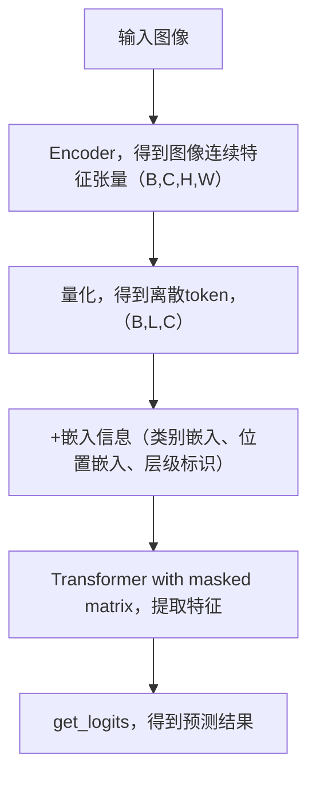

# VAR复现记录

[TOC]

## 计算资源预估

显存占用=模型参数显存+梯度显存+优化器状态显存+激活值显存+数据显存+框架开销

- 参数量

  论文中提到，模型的参数量 $N$ 与深度 $d$ 的关系如下
  $$
  N(d)=d*(4w^2+8w^2+6w^2)=18dw^2=73728d^2
  $$
  需要代入 $w=64d$ 

  - `FP16/BF16` ：2 byte/参数
  - `FP32` ：4 byte/参数

  `e.g.` ，对于 `1B` 参数的 `FP16` 模型 ，其显存占用为 $1\times 10^9\times2=2GB$ 

- 梯度显存

  梯度与参数同精度存储，所以对于 `1B` 参数的 `FP16` 模型，其梯度需要另外的 $2GB$ 显存

- 优化器显存

  | 优化器类型 | 计算公式                | 示例                            |
  | ---------- | ----------------------- | ------------------------------- |
  | SGD        | $\text{参数量}\times 0$ | $0GB$                           |
  | Adam       | $\text{参数量}\times 8$ | $1GB\times 8=8GB \space (FP32)$ |
  | AdamW      | $\text{参数量}\times 2$ | $1GB\times 2=2GB$               |

  `Adam` 需要存储动量与方差，它们的精度是 `FP32` ，而 `AdamW` 需要存储量化状态

- 激活值显存
  $$
  \text{Act\_Mem} = \text{batch\_size} \times \sum (\text{特征图尺寸} \times \text{通道数} \times 2\text{或4字节})
  $$
  前向激活：每层输出特征图缓存

  反向传播：部分中间结果需要保留（约是前向的 $1.5$ 倍）

  一般而言，激活值显存是模型参数显存的 $1\sim 3$ 倍（`Transformer` 较小，`CNN` 较大） 

- 数据显存
  $$
  \text{Data\_Mem} = \text{batch\_size} \times \text{输入尺寸} \times \text{通道数} \times \text{字节数}
  $$

- 框架开销

  `Pytorch` 框架会有 $300MB\sim 2GB$ 的固定开销

- 碎片化可能额外占用 $10\% \sim 20\%$ 

**关键影响因素** 

-  模型架构

  

- 

## 复现

- 租服务器

  - AutoDL，L2专区，选择空闲GPU多的（2/8）
  - VSCode连接服务器，ssh登录

- 下载VAR代码

  - ssh方式从github仓库上下载
    - 首先需要在服务器生成ssh密钥
    - 复制生成的公钥内容
    - 在github上add SSH key

- 配置环境

  - 使用conda新建虚拟环境

    ```sh
    conda create --name VAR python=3.9 
    ```

  - 下载VAR所需的库和依赖

    ```sh
    pip install -r requirements.txt
    ```

  - 新建一个tmux会话，到时候在这个会话中训练和推理、测试模型

- 训练

  - 构建数据集，按照README中指定形式，使用ImageNet-1K（2012）
    
    > 参考：[linux下载/解压ImageNet-1k数据集_imagenet1k下载-CSDN博客](https://blog.csdn.net/qq_45588019/article/details/125642466)
    
    - 问题：
    
      - 下载很慢
    
        - 扩容数据盘
    
        - 检查是否扩容成功，挂载磁盘（不用）
    
        - 在数据盘中下载imagenet，使用aria2c并行下载
    
    
        ```sh
        aria2c -x 16 -s 16 -d /root/autodl-tmp/downloads https://image-net.org/data/ILSVRC/2012/ILSVRC2012_img_train.tar
        ```
    
      - torchvision没安装
    
      - `importlib-metadata` 需要安装
    
      - tensorboard 重新安装：
    
        > [成功解决ModuleNotFoundError: No module named ‘tensorboard‘_modulenotfounderror: no module named 'tensorboard-CSDN博客](https://blog.csdn.net/qq_41813454/article/details/136284894)
    
      - ` torch.distributed.DistBackendError: NCCL error in: /pytorch/torch/csrc/distributed/c10d/NCCLUtils.hpp:268, invalid usage (run with NCCL_DEBUG=WARN for details), NCCL version 2.21.5`
    
        只需要nproc_per_node=1
    
      - huggingface连接不上
    
        `train.py` 的第96行，若是还没下载vae会直接1去huggingface原网站上下载而非镜像网站
    
      - ood错误，一个48GB的卡不够用
    
        需要租两张48GB的卡，并且减少batch_size，设置梯度累计步数为2
    
      - grad_norm在第一次训练时是 None，因此grad_norm.item()会报错Attribute Error
    
        因为原本ac为1，每次都会计算梯度，即stepping始终为True（见train.py line307），但是现在ac=2，最开始g_it=0，得到的stepping会是Fasle，传入trainer.py中，再传入utils.amp_sc（优化器AmpOptimizer）中，得到的grad_norm是None
    
        只需要加一个条件控制，若grad_norm是None，将它置为0，表示不进行梯度更新，若不为None，按照原来过程进行
    
  
- 推理

  - 下载仓库中的模型权重
    - 在仓库README中手动下载
    - 保存到本地
  - 修改路径为下载的权重路径，即可开始推理


## 代码阅读

* 在计算机视觉中，会将输入图像切分成一个个小块，每个小块叫做 `patch` ，是模型处理的基本单元。它可以（1）降低计算复杂度，因为一次需要处理的图像尺寸减小，相应的参数量、计算量也减小（2）适应模型输入，尤其对于使用Transformer模型很有帮助，因为Transformer往往需要使用固定的输入，可以将patch展平为向量作为它的输入（3）渐进式训练，让模型逐渐从低分辨率过渡到高分辨率，加速训练并提高模型稳定性
* 

- `train.py` ：训练入口
  
  - `build_everything` 函数
  
    - pipeline: (1) resume or not (2) create Logger (3) load data and create data loader (4) load pretrained model weights and construct VAE and VAR model (5) construct optimizer (6) build trainer (7) debug model: for quick check
  
    - 收获（1）训练pipeline清晰，如上所示，主要是：创建日志记录器—加载数据，转化成可迭代的DataLoader—构建模型架构—构建优化器—构建训练器—调试模式流程（可选，为了快速检查训练流程是否正确，包括随机生成数据集，一步训练，保存和恢复检查点，一步训练，打印和清理指标）（2）正是训练前先使用debug mode来检查训练pipeline
  
    - **疑惑**
  
      - `dist.barrier()` 用于控制进程同步，那如何知道什么时候需要同步呢
  
        - 日志初始化之后，防止非主进程在日志创建好前就尝试访问
        - 预训练权重下载之后，确保所有进程都下载好权重文件之后再尝试加载
        - 函数返回前，保证所有进程完成组件构建后再进入训练阶段
        - 总结：（1）共享资源访问前，如文件、网络端口（2）集体操作前，入广播、scatter/gather等集合通信（3）关键阶段过渡前，如从初始化阶段进入训练阶段
        - 不使用同步，容易导致进程之间抢占资源、发生冲突，（1）竞态条件，进程执行顺序不确定而导致冲突（2）文件访问冲突，一个进程在另一个进程写入前尝试读写（3）训练不同步，比如模型参数加载不一致
  
      - 构建优化器时融合优化是什么
  
        - 融合优化 `fused optimization` 是将多个计算步骤合并为单个内核执行的优化技术，具体例子是在 `build_everything` 中下面代码：
  
          ```python
          opt_clz = {
                  'adam':  partial(torch.optim.AdamW, betas=(0.9, 0.95), fused=args.afuse),
                  'adamw': partial(torch.optim.AdamW, betas=(0.9, 0.95), fused=args.afuse),
              }[args.opt.lower().strip()]
          ...
          var_optim = AmpOptimizer(
                  mixed_precision=args.fp16, # 是否启用FP16
                  optimizer=opt_clz(params=para_groups, **opt_kw), # 基础优化器
                  ...
              )
          ```
  
        - `fused optimization` 工作原理：以传统的 `Adam` 优化器为例，传统实现需要（1）计算梯度（2）计算一阶矩估计（3）计算二阶矩估计（4）更新梯度。
  
          融合优化将上述计算过程合并为单个 CUDA 内核，实现（1）内存访问优化，减少数据在寄存器和全局内存间的传输，计算速度较快（2）指令级并行，充分利用GPU流水线（3）减少内核启动开销，避免多次内核启动，合并为单个内核后只需要启动一次内核即可，计算速度较快
  
        - 条件：（1）CUDA架构兼容（2）参数量大时效果更明显（3）ptyorch 1.13+ ，版本支持更完善
  
  - `main_training` 函数
  
    - 搭建训练流水线：
  
      - （1）环境初始化：分布式环境初始化
  
      - （2）调用 `build_everything` 获取六大核心组件：日志记录器 起始epoch 1个epoch中的训练轮数 训练集长度 验证集长度等
  
      - （3）迭代训练
  
        - 单步训练
  
        - 更新指标
  
        - 每10个ep或最后一个ep使用验证集进行验证 + 保存检查点，保存双检查点【最新+最佳】
  
          **保存最佳时，在代码逻辑中当前模型就是最佳，所以不用再 `torch.save` 保存检查点，这样浪费时间，用 `shutil.copy` 保存副本，减少开销** 
  
      - 释放资源：显示删除大引用，多进程并行中尤其重要，进程会竞争有限显存，需要为Python回收留缓冲时间【防御性编程】
  
      - 将所有模型配置参数【lr batch_size param optimizer epoch iter ...】持久化写入日志【可恢复、日志完整性】
  
      - 保证进程同步 `dist.barrier()` 【分布式安全】
  
        
  
  - `train_one_ep` 函数：一个迭代周期 `epoch` 的训练流程
  
    - 初始化日志记录器及各种参数：会根据当前迭代次数动态调整学习率 `tlr` 和权重衰减 `wd` 【日志记录器 `MetricLogger` 是 `utils/misc.py` 中的类】
    - 遍历训练数据，`ld_or_itrt` 是迭代的训练数据集
      - 判断是否进行渐进式训练 `progressive training` ，计算训练阶段索引数 `prog_si` ，
      - 进行单步训练
      - 更新日志
      - 判断是否使用梯度裁剪
    - 使用 `me.synchronize_between_processes()` 在多进程中同步日志记录器

- `trainer.py` 
  - `VARTrainer` 类
    - 疑惑：什么是平滑标签，什么是逐元素损失和均值损失、
    
    
    
    - 主要函数是 `__init__` `train_step` `eval_ep` 
    
      - `__init__` ：初始化
    
      - `train_step` ：
    
        - params：`it` `g_it` `stepping` `me_logger` `tf_logger` 样本`inp_B3HW` 标签`label_B` 训练阶段的索引`prog_si` 预热步数`prog_wp_it`
        - 返回梯度信息 
        - 单步训练，训练流程（1）预处理，`img` -> `token` -> `quantized feature map` （2）前向传播，计算loss、acc（3）反向传播，得到梯度并进行更新（4）使用日志记录器 `me_logger` `tf_logger` 
    
        【**小trick** ：使用了热身系数，$prog\_wp=\max(\min(prog\_it/prog\_wp\_it),0.01)$ ，$prog\_wp$ ，它用于在更新权重系数时专门对当前分辨率区间的系数进行注意力引导，逐步关注新特征而非一开始就十分关注，实现系数的平滑过渡，防止loss突变，还会随着训练进行而不断增大，到后期接近于1，权重更新正常，不再专门针对特殊区域乘上特殊系数。
    
        例如，当 $prog\_wp=0$ 时，模型主要针对医学系区域进行更新，当 $prog\_wp=1$ 时，模型对所有区域同步优化。
    
        从直观上理解，对于一个区域，观察都是由粗略到细致，在向更高分辨率过渡的过程中，（1）首先是粗糙的观察，此时 $prog\_wp=0$ ，防止新区域引入过量未学习的噪声，也避免新参数覆盖原参数，导致灾难性遗忘（2）在中期开始修正细节，$prog\_wp$ 逐渐增大，新区域的参数也随之增大，模型开始修正细节（3）在最后阶段，是对生成图像进行精调的阶段，此时能够新学习的东西已经不多了，参数变化幅度不会很大，模型对新区域和已学习区域进行同步优化】
    
      - `eval_ep` ：
    
        - param：DataLoader类型的验证集
        - 返回：各种指标，`Lm` `Lt` `Accm` `Acct` `sun(batch_size)` `eval time` 
        - 训练过程中的验证步骤，流程（1）禁用梯度（2）数据处理，同上（3）前向传播（4）记录状态在 `me_logger` `tf_logger` 

- `models/`
  - `VAR.py` ：读懂原论文中的 `algorithm 1` 与 `algorithm 2` + `Figure 4` 。
    - `algorithm 1` ：首先对 `imput_image` 进行编码，转化为特征图 `f` 矩阵，然后将其分成 `K` 个分辨率由小到大的 `f` 矩阵集合，即不同的 `patch`，**实现流程** 是（1）对特征图 `f` 进行插值，将i调整到目标分辨率大小 `(h_k,w_k)` ，每一轮的 `f` 关注的是模型还未提取到的内容（2）将插值后的 `f` 进行量化，得到索引 `r_k` 并 **存储** （3）对 `r_k` 索引矩阵，在Codebook中查找，得到量化后的新特征 `z_k` （4）对新特征 `z_k` 进行插值，恢复到原图像的分辨率 `(h_K,w_K)` （5）使用卷积提取查之后新特征图包含的图像信息，用 `f` 减去当前已提取的信息，这样在后续更高分辨率的patch中，得到的特征图会更加关注之前没有关注到的细节，避免冗余。
  
    - `algorithm 2` ：接着刚刚存储的各个不同分辨率的索引特征进行操作，流程是（1）使用索引 `r_k` 在Codebook进行查找，得到该分辨率量化后的新特征 `z_k` （2）将 `z_k` 插值回原始图像大小（3） 将插值后的新特征 `z_k` 进行卷积，再加入特征图 `f` 中（4）最后特征图 `f` 能够捕捉不同分辨率上图像的细节并存储，对 `f`  进行解码即可 **重建** 图像
  
    - 代码细节：
  
      - `__init__` 
  
        - 超参数：`embed_dim` `B`  `L` `C` `D` `num_heads` `prog_si` ... 
        - 词嵌入：引用了 `VQ-VAE` 的量化器，引用不占太大空间并且访问速度快
        - 类别嵌入
        - 位置编码
        - 层级标识嵌入
        - 共享自适应线性层：将条件向量映射成 `6` 组参数，为 AdaLN做准备
        - Transformer块，注意力掩码
        - 分类头：输出概率分布
  
      - `forward` ：前向传播计算当前尺度每个位置token的概率分布，流程是（1）制作输入：传入的参数是已量化的离散token，是真实向量（教师强制）。若是起始阶段，就使用标签类别嵌入的结果作为输入，加上层级标识、位置编码；若是进行到一定阶段，需要用label的类别嵌入结果拼接使用Codebook得到的连续teacher的条件向量，再加上层级标识、位置编码（2）先制作下三角掩码（3）将输入、条件向量、掩码转化为计算使用的主类型，保证精度一致（4）使用掩码让所有Transformer块逐块提取输入的特征，得到结果logits（5）使用分类头返回未归一化的结果，用于计算交叉熵损失
  
        *简化版流程* ：（1）输入+嵌入信息（2）Transformer（3）AdaLN条件归一化（4）线性投影（5）输出未归一化的logits。其中（4）（5）是`get_logits` 方法中实现的，其他是 `forward` 方法中实现的
  
      - `autoregressive_infer_cfg` ：推理，流程是（1）制作输入，用上一个尺度的结果初始化当前输入（2）使用所有Transformer块逐个提取x特征，最后并行化一次性输出每个token的概率分布。**启用KV Cache加速自回归生成** （3）条件控制CFG，融合有条件与无条件（4）使用top_k/top_p采样，`more_smooth` 会使用 `Gummbel` 软化采样（5）使用Codebook将采样结果由离散token转化为连续特征（6）下一尺度初始化使用连续特征加上类别嵌入、层级标识、位置嵌入的结果，双倍B（7）最后返回融合多尺度特征，并使用 `VQ-VAE` 解码重建的图像张量，归一化到[0,1]
  
        *简化版流程* ：（1）输入，上一尺度的预测结果，加上嵌入信息（2）Transformer块提取特征，KV Cache加速（3）条件控制，混合有条件与无条件，双倍B（4）`get_logits` 得到AdaLN归一化+线性投影后的概率分布（5）top_k/top_p采样（6）Codebook将离散token转化为连续特征（7）`f` 整合所有尺度特征图信息，最后对 `f` 进行解码重构，返回归一化的图像张量
  
        【训练和推理使用同样的 `get_logits` ，保证输出的概率分布在同一kon】
  
        | 方面        | forward【训练】                                  | autoregressive_infer_cfg【推理】 |
        | ----------- | ------------------------------------------------ | -------------------------------- |
        | 输入        | 教师强制，用真实label                            | 上一尺度的预测结果，自回归       |
        | 掩码        | 使用下三角掩码                                   | 无掩码，使用KV Cache加速         |
        | 条件控制CFG | 随即丢弃标签 `cond_drop_rate` ，单分支条件       | CFG混合条件，双分支条件，双倍B   |
        | 精度管理    | 对输入、条件向量、掩码显式转化条件，保证精度一致 | 无显示处理（推理时全精度）       |
        | 输出        | 所有token的logits                                | 最终的图像张量，元素范围[0,1]    |
  
      - `init_weight` ：分层初始化，精细
  
        
  
    - 【疑惑】：top_k sampling 和 top_p sampling 是什么，位置编码的原理 推理为什么要使用条件控制，为什么还要采用，为什么要嵌入信息、什么时候要 为什么要双倍Batch 为什么推理时用KV Cache，但是训练时不用
  
  - `vqvae.py` 
  
    - `__init__` ：参数初始化，量化组件初始化
    - `fhat_to_img` ：输出图像张量，元素范围是[-1,1]，流程是（1）将量化后的离散token转为连续向量（2）使用量化卷积层提取特征（3）对卷积结果进行重建（4）数值裁剪，返回图像张量的元素大小在 `[-1,1]` 之间
    - `img_to_idxBl` ：将输入图像张量张量转化为离散索引，流程是（1）对输入向量编码，得到潜在表示【图像分析】（2）对编码后的特征进行卷积【提取特征】（2）使用 `VQ2` 量化器将卷积结果转化为 `Codebook` 中的索引【压缩】
    - 【疑惑】为什么流程是 编码 卷积 量化 编码和卷积的意义何在，不能直接进行量化吗
  
  - `basic_vae.py`
  
    - `Encoder` 类
  
      - 结构 `__init__`：
  
        - 卷积层，先对输入图像进行卷积，映射到基础通道数 `ch` 
  
        - 下采样层：
  
          - 循环，循环次数为原始分辨率阶段数，在每个循环中
  
            - num_resnet个残差块
            - 若是最高一级且使用注意力，加上注意力块（这样就是残差块-注意力块-残差块-注意力块-....）
            - 最后加上下采样层，图像宽高减半【非最高一级才添加】
    
            【下采样层是自定义的，使用了 `kernel_size=3 stride=2 padding=(0,1,0,1)` 的卷积层（右/下各补一行/列），通道数不变】
    
          【trick：使用该通道倍增系数 `ch_mult` ，输出使用原始 `ch_mult` ，输入使用 `(1,)+ch_mult` ，实现错位，在原代码中，能够实现第一次残差快的输入输出通道数相同，后面的输出通道数是输入通道书的两倍】
    
        - 中间层，保持输入输出通道数不变，分辨率不变，通过 **残差+注意力+残差** 提高提取特征的能力
    
          - 残差块，输入通道数=最后一个下采样阶段的输出通道数（因为残差块不改变输入输出通道数和分辨率）
          - 注意力块
          - 残差块
    
        - 输出层
    
          - 组归一化
          - SilU激活函数
          - 卷积层，会根据 `double_z` 判断是否需要双倍通道
    
        【设计点：渐进式压缩，仅在深层使用注意力，平衡计算开销和全局建模能力，残差连接贯穿始终，保证梯度流动】
    
        下面 `ResNet` 的通道数扩展是在第一个 `ResNet block` 实现的，第二个 `ResNet block` 保持通道数不变  
    
        ```html
        输入 [3, H, W]
        │
        ├─ conv_in: [128, H, W]  
        │
        ├─ 层级0 (i_level=0): 
        │   ├─ ResnetBlock ×2: [128, H, W] → [128, H, W]  
        │   └─ 下采样: [128, H/2, W/2]  
        │
        ├─ 层级1 (i_level=1): 
        │   ├─ ResnetBlock ×2: [128, H/2, W/2] → [256, H/2, W/2]  
        │   └─ 下采样: [256, H/4, W/4]  
        │
        ├─ 层级2 (i_level=2): 
        │   ├─ ResnetBlock ×2: [256, H/4, W/4] → [512, H/4, W/4]  
        │   └─ 下采样: [512, H/8, W/8]  
        │
        ├─ 层级3 (i_level=3, 最高一级): 
        │   ├─ ResnetBlock1: [512, H/8, W/8] → [1024, H/8, W/8] 
        |	├─ AttnBlock1:   [1024, H/8, W/8]  
        |	├─ ResnetBlock2: [1024, H/8, W/8]                  
        |	├─ AttnBlock2:   [1024, H/8, W/8]                  
        |	└─ 输出: [1024, H/8, W/8]  # 传递给中间层  
        │
        ├─ 中间层: 
        │   ├─ ResnetBlock: [1024, H/8, W/8]  
        │   ├─ AttnBlock（若 using_mid_sa=True)  
        │   └─ ResnetBlock: [1024, H/8, W/8]  
        │
        └─ 输出层: 
            ├─ GroupNorm + SiLU  
            └─ conv_out: [z_channels, H/8, W/8]  
        ```
    
      - 前向传播 `forward` 
    
        - 按照结构逐块传递，先下采样，再进行中间处理，最后输出
    
      - 【疑惑】double_z=False：是否输出双倍通道（用于KL-VAE） Conv2d是如何保证in_channels和out_channels一定按照传入参数的，不是还要受到kernnel_size stride padding的影响吗  为什么stride=1且kernel_size!=1能够保持分辨率不变，H W不是变化了吗  
    
      - 下采样操作：减小宽高，提升感受野，每个像素点需要承载更多信息。与输入输出通道数无关，输出通道数多，能够捕捉更加复杂的特征组合。
    
        下采样是指任何用于降低分辨率的操作，是广义的概念，包括跨步卷积 (stride>1)、汇聚、插值。汇聚 `pooling` 是下采样的一种具体方法，仅指平均汇聚与最大汇聚等固定操作
    
    - `Decoder` 类
    
      - 结构 `__init__` ：与 `Encoder` 类似
    
        - 卷积：输入先通过卷积层，映射到基础通道数
        - 上采样层：
          - 循环，反向遍历通道倍增系数，按照相反比例减少通道数目
            - **`num_resnet+1`** 个残差块，第一个残差块实现通道数的减少，剩余残差快保持通道数不变，`+1` 更强调解码能力
            - 若是到达最高一级且使用注意力块，加上注意力块
            - 加上上采样层【**非最低一级**】
        - 中间层，保证通道数和分辨率不变，提高特征提取能力
          - 残差块
          - 注意力块
          - 残差块
        - 输出层
          - 组归一化
          - SiLU函数激活
          - 卷积层
    
        【设计点：渐进式重建，在最深层加上注意力，平衡了计算成本和全局建模能力，Decoder比Encoder多了一个残差块，补偿信息损失】
    
        ```html
        输入 [z_channels, H/8, W/8]
        │
        ├─ conv_in: [1024, H/8, W/8]  # 扩展到最大通道数
        │
        ├─ 层级3 (i_level=3): 
        │   ├─ ResnetBlock ×3: [1024, H/8, W/8] → [1024, H/8, W/8]  
        │   └─ AttnBlock（若 using_sa=True）
        │
        ├─ 层级2 (i_level=2): 
        │   ├─ ResnetBlock ×3: [1024, H/8, W/8] → [512, H/8, W/8]  
        │   └─ 上采样: [512, H/4, W/4]  
        │
        ├─ 层级1 (i_level=1): 
        │   ├─ ResnetBlock ×3: [512, H/4, W/4] → [256, H/4, W/4]  
        │   └─ 上采样: [256, H/2, W/2]  
        │
        ├─ 层级0 (i_level=0): 
        │   ├─ ResnetBlock ×3: [256, H/2, W/2] → [128, H/2, W/2]  
        │   └─ 无上采样（因已到原始分辨率）
        │
        ├─ 中间层: 
        │   ├─ ResnetBlock: [128, H/2, W/2]  
        │   ├─ AttnBlock（若 using_mid_sa=True)  
        │   └─ ResnetBlock: [128, H/2, W/2]  
        │
        └─ 输出层: 
            ├─ GroupNorm + SiLU  
            └─ conv_out: [3, H, W]  # 重建图像
        ```

- 整理

  - 运行流程：train.py —> trainer.py —> models/var.py —> models/vqvae.py —> models/basic_vae.py

  - train.py开始训练，主要训练函数是 `main_training` 函数，先创建好分布式环境，然后调用 `build_everything` 函数获取六大核心组件，包括训练集、验证集、迭代轮数、全局迭代轮数、当前迭代轮数等

    在分配好环境、初始化好参数后，调用 `train_one_ep` 函数进行训练。根据当前迭代轮数，计算训练阶段索引，得到当前输入图像的分辨率大小，送入VAR模型进行训练。

    **训练阶段，**对于输入的图像张量，分为两步，一是编码，二是解码重构。

    - 输入：输入是经过Encoder编码、VQ量化器量化的离散token。

      - Encoder编码 `(models/basic_vae.py)` ：（1）卷积，映射到基础通道数（2）经过 `len(patch)` 个层级，每个层级中包含 `num_resnet` 个残差块和 `1` 个下采样块（除最高一级外），在最高一级中，若是允许注意力，需要加入注意力块，然后经过 `1` 个残差块，`1` 个自注意力块，`1` 个残差块，最后经过组归一化、SiLU激活、卷积，输出编码后的图像张量
      - VQ量化器量化

    - var会先对所有尺度的离散token加上对应的嵌入信息（类别嵌入、位置嵌入、层级标识），然后用transformer提取特征，得到的特征送入 `get_logits` 函数，结合条件向量动态调整自适应层归一化参数，再线性投影到 $V$ 维度，返回未归一化的预测结果。

      这里的条件向量是随输入图像一起传入的真实标签（教师强制），在Transformer提取特征时，需要制作下三角掩码，保证自回归特性。在具体进行Transformer提取特征前，先要把 `input` `cond_B` `masker_atten` 转化为计算主类型，保证精度一致。

    - 训练阶段直接使用未归一化的预测结果计算交叉熵损失，不需要解码重构

    **推理阶段** 

    - 输入：输入是经过Encoder编码、VQ量化器的离散token，过程同上

    - var对于输入所有尺度的离散token，先加上各自的嵌入信息，然后使用Transformer层提取特征，送入 `get_logits` 函数归一化+线性投影获得预测结果，对预测结果先进行双分支混合，使用双倍通道B，再进行top_p/top_k采样，接下来是重构的过程，对于所有尺度的预测结果，先使用Codebook将离散索引转化为连续特征，然后再将连续特征加到特征图  `f` 上，最后对 `f` 进行解码重构。

      【Transformer无需使用掩码，需要使用KV Cache加速】

    - 解码的过程与编码恰好相反。（1）卷积，映射到基础输出通道（2）一共有 `len(patch)` 个层级，每个层级都包含 `num_resnet+1` 个残差块，`1` 个上采样块（除最低一级外），在最高一级若是允许自注意力，就加上注意力块，然后通过 `1` 个残差块，`1` 个自注意力块，`1` 个残差块，再通过组归一化、SiLU激活函数、卷积，输出结果

    - 最后会对解码结果进行数值裁剪，保证返回的图像张量中每个元素的值都在[-1,1]之间

  - 



